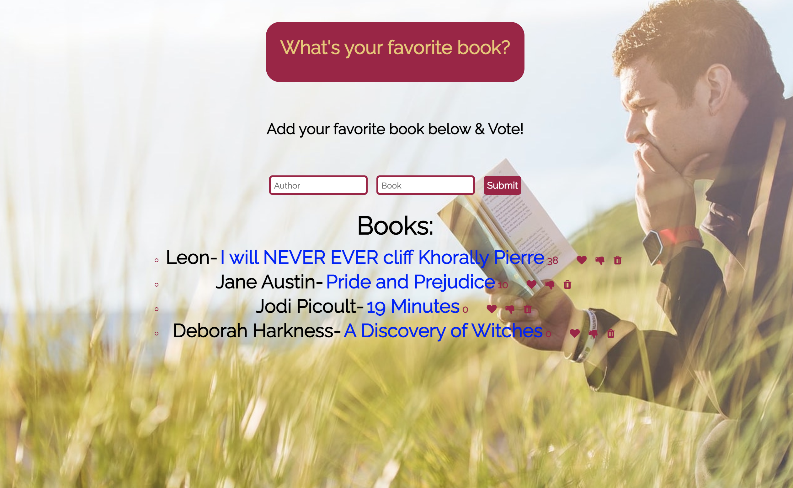

# What-s-Your-Favorite-Book

Welcome to my Favorite Book site! Here, users can add their favorite books, and those books get upvoted or downvoted by other users. Log in and insert your favorite book to see how others feel about it! Vote too while you're at it!

How It's Made:
Tech used: HTML, CSS, JavaScript, and MongoDB, how to build an API using CRUD

Lessons Learned:
Nothing in tech is daunting as long as you make it fun! I love to read (fun fact: it's how I learned how to speak English), so using this theme has really enhanced my ability to learn new content. Most importantly, I learned how to incorporate thumbs up and thumbs down features to update data using MongoDB.

Examples:
Take a look at these couple examples that I have in my own portfolio:

https://wonderful-easley-4bdc4b.netlify.app/

https://hopeful-hamilton-96af68.netlify.app/

https://zealous-dubinsky-e78c32.netlify.app
